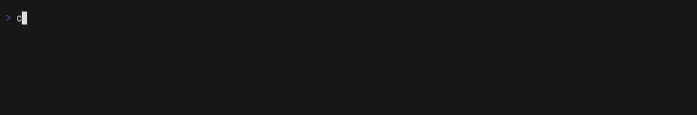
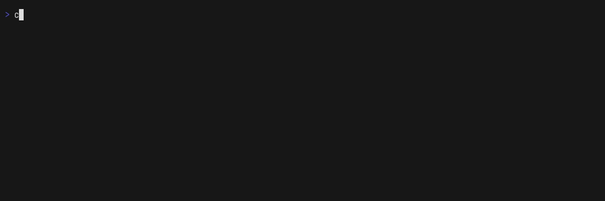

# Progress Bar

(name TBD)

A concurrent progress bar system for keeping track of progress of
different threads by showing progress bars in the console.

> [!WARNING]
> This project is highly WIP, so don't be surprised if it breaks :D

The `multi` example produces the following:

Another example in my repo for generating Minecraft resource packs [here](https://github.com/funnyboy-roks/generated-resource-packs-rs)

